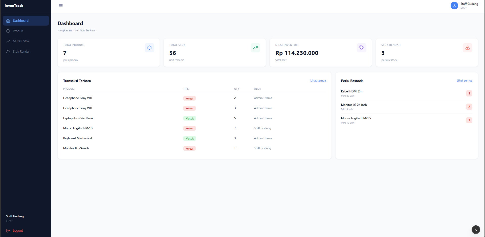
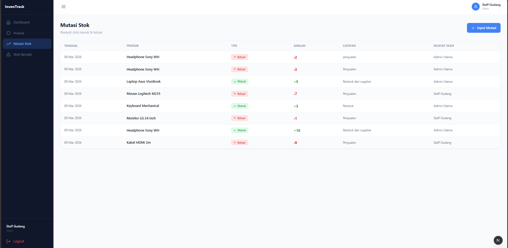
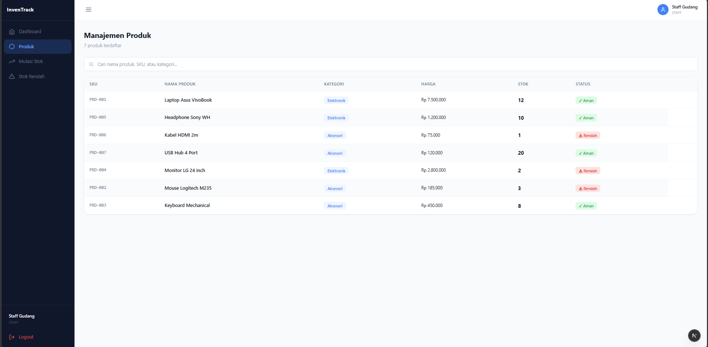
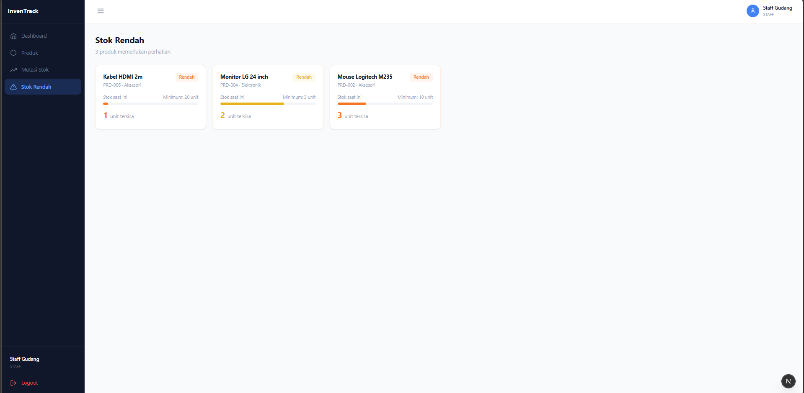

<div align="center">

  <h1>InvenTrack</h1>
  <p>Web-based Inventory Management System</p>

  <p>
    
    
    
    
    
    
  </p>

  <p>
    <a href="#-features">Features</a> •
    <a href="#-tech-stack">Tech Stack</a> •
    <a href="#-getting-started">Getting Started</a> •
    <a href="#-demo-accounts">Demo</a> •
    <a href="#-api-endpoints">API</a>
  </p>

</div>

---

## Overview

InvenTrack is a full-stack web application for managing product inventory. Built as a portfolio project to demonstrate real-world implementation of modern web technologies including authentication, database relations, REST API, and role-based access control.





---

## Features

| Feature | Description |
|---|---|
| **Authentication** | Secure login with bcrypt-hashed passwords and JWT session management |
| **Role-based Access** | Admin can manage products; Staff can only view and record stock mutations |
| **Dashboard** | Real-time overview of total products, stock value, and recent transactions |
| **Product Management** | Full CRUD — create, read, update, and delete products with SKU and category |
| **Stock Mutations** | Record stock in/out with automatic balance update using database transactions |
| **Low Stock Alerts** | Visual indicators and warnings when stock falls below minimum threshold |

---

## Tech Stack

```
Frontend    →  Next.js 15 (App Router) + React + Tailwind CSS
Backend     →  Next.js API Routes
Database    →  SQLite + Prisma ORM
Auth        →  NextAuth.js + bcryptjs
Runtime     →  Node.js 22
```

---

## Project Structure

```
inventory-app/
├── prisma/
│   ├── schema.prisma        # Database schema (User, Product, Category, StockTransaction)
│   └── seed.js              # Demo data seeder
├── src/
│   ├── app/
│   │   ├── api/
│   │   │   ├── auth/[...nextauth]/route.js   # NextAuth handler
│   │   │   ├── products/route.js             # GET all, POST create
│   │   │   ├── products/[id]/route.js        # PUT update, DELETE
│   │   │   └── stock/route.js                # POST stock mutation
│   │   ├── dashboard/
│   │   │   ├── layout.js                     # Sidebar + topbar (shared)
│   │   │   ├── page.js                       # Dashboard overview
│   │   │   ├── produk/
│   │   │   │   ├── page.js                   # Server Component (fetch DB)
│   │   │   │   └── ProductsClient.js         # Client Component (CRUD UI)
│   │   │   ├── stok/
│   │   │   │   ├── page.js                   # Server Component
│   │   │   │   └── StokClient.js             # Client Component
│   │   │   └── alerts/page.js                # Low stock alerts
│   │   ├── login/page.js                     # Login page
│   │   ├── providers.js                      # NextAuth SessionProvider
│   │   └── layout.js                         # Root layout
│   ├── lib/
│   │   └── prisma.js                         # Prisma client singleton
│   └── middleware.js                         # Route protection
└── .env                                      # Environment variables
```

---

## Getting Started

### Prerequisites

- Node.js 18 or higher
- npm

### Installation

**1. Clone the repository**

```bash
git clone https://github.com/your-username/inventory-app.git
cd inventory-app
```

**2. Install dependencies**

```bash
npm install
```

**3. Set up environment variables**

Create a `.env` file in the root directory:

```env
DATABASE_URL="file:./dev.db"
NEXTAUTH_SECRET="your-secret-key-here"
NEXTAUTH_URL="http://localhost:3000"
```

**4. Run database migration**

```bash
npx prisma migrate dev --name init
```

**5. Seed demo data**

```bash
npx prisma db seed
```

**6. Start development server**

```bash
npm run dev
```

Open [http://localhost:3000](http://localhost:3000) in your browser.

---

## Demo Accounts

| Role | Email | Password |
|---|---|---|
| Admin | admin@inventory.com | admin123 |
| Staff | staff@inventory.com | staff123 |

> **Admin** — full access: create, edit, delete products, and record stock mutations.  
> **Staff** — limited access: view products and record stock mutations only.

---

## Database Schema

```
User ──────────────────────┐
                           ↓
Category ──→ Product ──→ StockTransaction
```

| Table | Description |
|---|---|
| `User` | Login credentials (hashed password) and role |
| `Category` | Product categories |
| `Product` | SKU, name, price, current stock, minimum stock threshold |
| `StockTransaction` | Every stock in/out event with quantity, note, and user reference |

---

## API Endpoints

| Method | Endpoint | Description | Access |
|---|---|---|---|
| `POST` | `/api/auth/signin` | Login | Public |
| `GET` | `/api/products` | Get all products | Auth |
| `POST` | `/api/products` | Create product | Admin |
| `PUT` | `/api/products/[id]` | Update product | Admin |
| `DELETE` | `/api/products/[id]` | Delete product | Admin |
| `POST` | `/api/stock` | Record stock mutation | Auth |

---

## Key Concepts Demonstrated

- **Next.js App Router** — file-based routing with nested layouts
- **Server vs Client Components** — data fetching on the server, interactivity on the client
- **Prisma ORM** — type-safe database queries with model relations
- **Prisma Transactions** — atomic operations ensuring data consistency
- **JWT Authentication** — stateless session management with NextAuth.js
- **Role-based Access Control** — permission checks at both UI and API level
- **REST API** — clean separation between frontend and backend logic

---

## Screenshots

> Coming soon — add screenshots of Dashboard, Product page, Stock mutation, and Low stock alerts.

---

## License

This project is open source and available under the [MIT License](LICENSE).